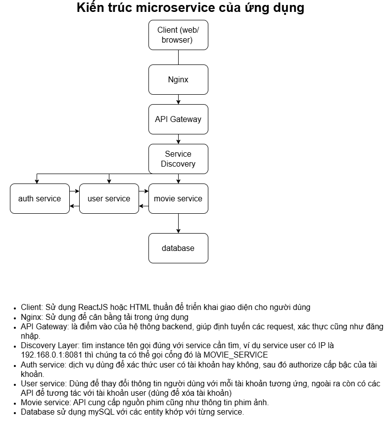

# Microservice_Netflix
A Movie providing web application, which built back-end server based on Microservice architecture.

# System design

Phân vùng và đặc quyền của từng loại tài khoản
1. User : 
- Đăng kí
- Đăng nhập
- Xem phim
- Tìm kiếm phim
- Lưu phim yêu thích
- Lịch sử xem phim
2. Supervisor:
- Thêm phim
- Chỉnh sửa thông tin phim
- Xóa phim
3. Admin:
- Thêm tài khoản
- Thay đổi cấp quyền cho tài khoản
- Xóa tài khoản

# Danh sách API
1. Auth service:
- POST /auth/register
- POST /auth/login
2. Movie service:
- GET /movies
- GET /movies/{id}
- POST /movies
- DELETE /movies/{id}
3. User service
- GET /users/me
- PUT /users/me
- POST /users/me/favorites
- GET /users/me/favorites
- GET /admin/users (có thể thêm query param)
- GET /admin/users/{id}
- PUT /admin/users/{id}
- PATCH /admin/users/{id}/enable
- DELETE /admin/users/{id}
# Phân quyền API
Sử dụng Spring Security
\
| Endpoint            | Role  |\
| ------------------- | ----- |\
| /users/me           | USER  |\
| /users/me/favorites | USER  |\
| /admin/users        | ADMIN |\

