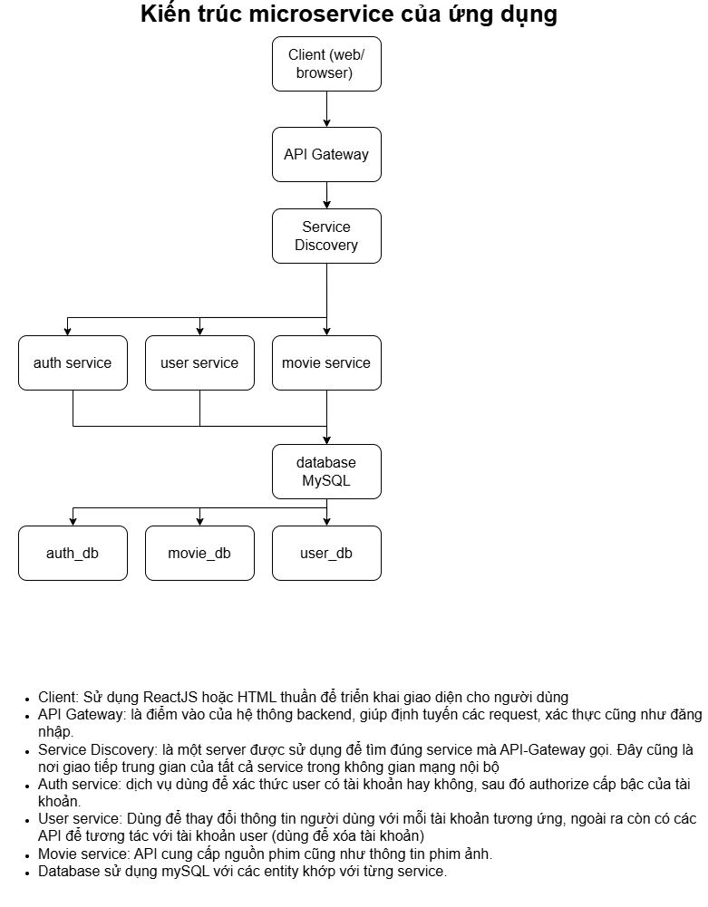
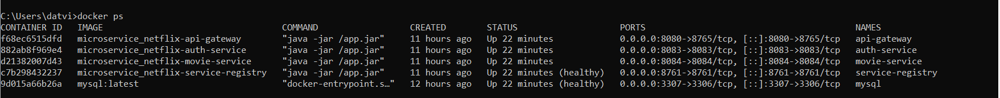
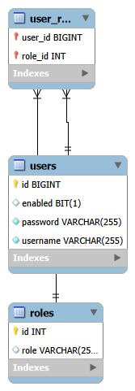
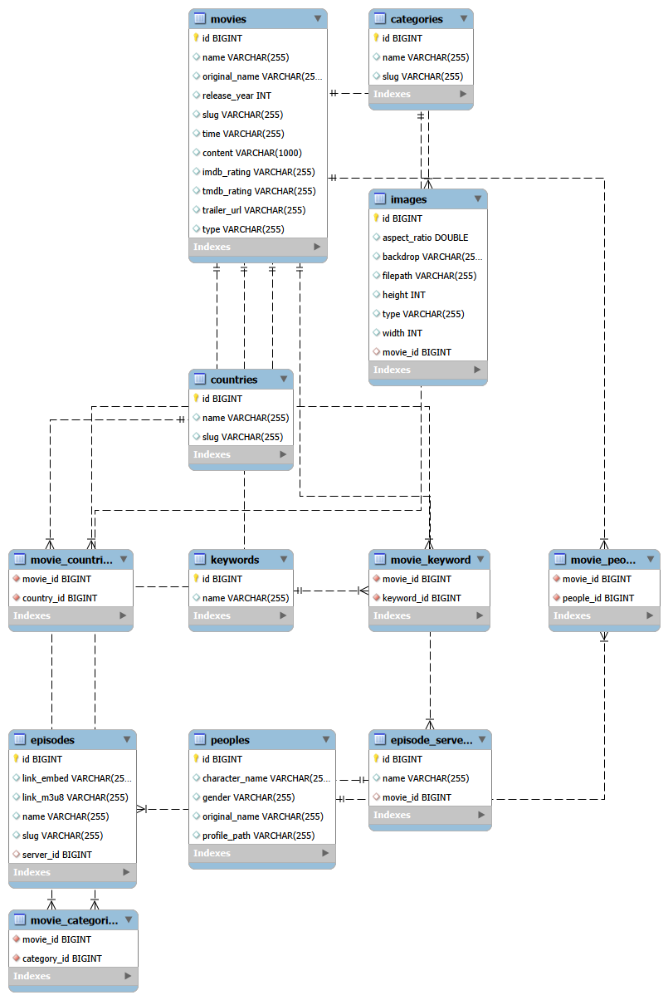

# Microservice_Netflix
A Movie providing web application, which built back-end server based on Microservice architecture.

# System design

Phân vùng và đặc quyền của từng loại tài khoản
1. User : 
- Đăng kí
- Đăng nhập
- Xem phim
- Tìm kiếm phim
- Lưu phim yêu thích
- Lịch sử xem phim
2. Supervisor:
- Thêm phim
- Chỉnh sửa thông tin phim
- Xóa phim
3. Admin:
- Thêm tài khoản
- Thay đổi cấp quyền cho tài khoản
- Xóa tài khoản

# Mapping Network

 

# Danh sách API  
1. Auth service:
- POST /auth/register ✅
- POST /auth/login ✅
- PATCH /auth//update_authorization/{id} ✅
2. Movie service:
- GET /api/movies (có thể thêm param page để phân trang) ✅
- GET /api/movies/{slug} với slug là tên slug của phim ✅
- GET /api/movies/search với param là keyword để tìm kiếm và param page để phân trang ✅
- POST /api/movies ⏳
- DELETE /api/movies/{id} ✅
3. User service 
- GET /users/me ✅
- PUT /users/me ✅
- POST /users/me/favorites ✅
- GET /users/me/favorites ✅
- GET /admin/users (có thể thêm query param) ⏳
- GET /api/users ✅
- PUT /api/users ✅
- DELETE /api/users/{id} ✅
# Phân quyền API ⏳
# Mối quan hệ giữa các bảng trong database

1. auth_db  

 

2. movie_db  

 

